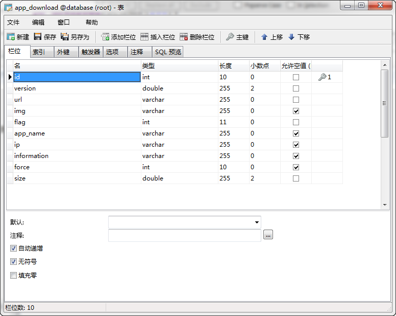
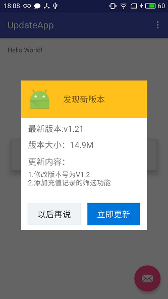
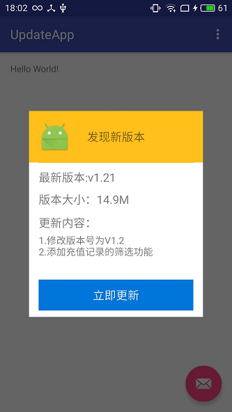
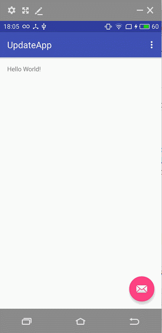

#Android App升级的方案
### 一、介绍一下服务器的操作。
#### 1.看看数据库表。

注意到force这参数，force=1，强制升级，force=0，自愿升级。
### 二、自选升级。
#### 1.调用升级接口，查看version的版本号，如果版本号大于当前app的版本号，那么就触发显示升级对话框。代码如下：
          /**
     * 联网获取更新数据
     */
    private void getUpdateInfo(){
    Log.e("TAG", "FolderActivity getUpdateInfo");
    Map<String,String> map=new HashMap<>();
    map.put("flag","1");
    CommonUtils.showProgress(this,"正在检查更新，请稍等...");
    CommonUtils.Get(NetUrl.UPDATE_URL, map, new MyCallBack<String>() {
    
    @Override
    public void onSuccess(String result) {
    //if(result.contains("data")){
    CacheUtils.getInstance(MainActivity.this).getValue(NetUrl.UPDATE_URL, result);
    CommonUtils.cancelProgress();
    CacheUtils.getInstance(MainActivity.this).putValue(NetUrl.UPDATE_URL,result);
    parseUpdateData(result);
    }
    
    @Override
    public void onError(Throwable ex, boolean isOnCallback) {
    CommonUtils.cancelProgress();
    CommonUtils.showToast(MainActivity.this,getResources().getString(R.string.get_error_text));
    }
    
    });
    
    }
    
    /**
     * 解析更新数据
     * @param result
     */
    private void parseUpdateData(String result) {
    UpdateInfoBean updateInfoBean = CUtils.getGson().fromJson(result, UpdateInfoBean.class);
    UpdateInfoBean.DataBean data = updateInfoBean.getData();
    double versionName = Double.parseDouble(CommonUtils.getAppVersionName(this));
    Log.e("TAG", ""+versionName+":"+data.getVersion());
    if(versionName<data.getVersion()){
    showUpdateDialog();
    }else{
    CommonUtils.showToast(this,"当前已经是最新版本！");
    }
    
    }
    
    /**
     * 显示更新的对话框
     */
    private void showUpdateDialog() {
    Intent intent = new Intent(this, DownloadActivity.class);
    startActivity(intent);
    }

升级对话框如图：

#### 2.在升级对话框中，点击立刻更新，会在后台的通知栏中更新，退出，可以正常退出。代码需要重新写了个service在后台运行。代码和截图如下，注意service要在配置文件中注册。
    public class DownLoadService extends Service {
    private static final String BASE_PATH = Environment.getExternalStorageDirectory().getPath() + File.separator;
    private String path=BASE_PATH+"hrobbie"+"/hrobbie.apk";
    private Notification.Builder builder;
    private NotificationManager notificationManager;
    private int number;
    private Notification build;
    
    @Nullable
    @Override
    public IBinder onBind(Intent intent) {
    return null;
    }
    
    @Override
    public void onCreate() {
    super.onCreate();
    notificationManager = (NotificationManager) getSystemService(NOTIFICATION_SERVICE);
    builder = new Notification.Builder(DownLoadService.this);
    }
    
    @Override
    public int onStartCommand(Intent intent, final int flags, int startId) {
    number = startId;
    String download_url = intent.getStringExtra("download_url");
    //downloadFile(download_url);
    Log.e("TAG", "DownloadService download_url="+download_url);
    Log.e("TAG", "DownloadService path="+path);
    builder.setSmallIcon(R.mipmap.ic_launcher).setContentTitle("一款应用正在下载0%").setWhen(System.currentTimeMillis())
    .setPriority(Notification.PRIORITY_MAX).setTicker("一款应用下载").setOngoing(false).setAutoCancel(true)
    .setContentIntent(PendingIntent.getActivity(this, 0, new Intent(), 0));
    
    
    downloadFile(download_url);
    
    
    
    return super.onStartCommand(intent, flags, startId);
    
    }
    
    private void downloadFile(String download_url) {
    RequestParams requestParams = new RequestParams(download_url);
    requestParams.setAutoResume(true);
    //requestParams.setAutoRename(true);//断点下载
    
    requestParams.setSaveFilePath(path);
    
    
    x.http().get(requestParams, new Callback.ProgressCallback<File>() {
    @Override
    public void onWaiting() {
    
    }
    
    @Override
    public void onStarted() {
    }
    
    @Override
    public void onLoading(long total, long current, boolean isDownloading) {
    builder.setContentTitle("一款应用正在下载"+(int)((double)current/total*100)+"%").setProgress((int)total,(int)current,false);
       send();
    
    }
    
    @Override
    public void onSuccess(File result) {
    builder.setContentTitle("一款应用下载完成100%").setProgress(100, 100, false);
    send();
    openFile(result);
    }
    
    @Override
    public void onError(Throwable ex, boolean isOnCallback) {
    Toast.makeText(DownLoadService.this,"下载失败，请检查网络和SD卡",Toast.LENGTH_SHORT).show();
    //CommonUtil.showToast(DownLoadService.this,"下载失败，请检查网络和SD卡");
    }
    
    @Override
    public void onCancelled(CancelledException cex) {
    }
    
    @Override
    public void onFinished() {
    }
    });
    }
    
    
    //打开APK程序代码
    
    private void openFile(File file) {
    // TODO Auto-generated method stub
    Log.e("OpenFile", file.getName());
    Intent intent = new Intent();
    intent.addFlags(Intent.FLAG_ACTIVITY_NEW_TASK);
    intent.setAction(Intent.ACTION_VIEW);
    intent.setDataAndType(Uri.fromFile(file),
    "application/vnd.android.package-archive");
    startActivity(intent);
    }
    
    private void send(){
    build = builder.build();
    notificationManager.notify(number, build);
    }
    }
#### 如图：

### 三、强制升级。
#### 1.当收到服务器的force=1时，需要强制升级，这个时候，需要展示的界面如下：

#### 2.点击立刻更新，会出现一个progressBar进行更新，如图：

#### 3.如果此时强制退出，要销魂app，用的方法，代码如下：
     private long curMillios = 0;
    private boolean showExitToast(){
    long time = System.currentTimeMillis();
    if (time - curMillios < 2000){
    return true;
    }
    
    curMillios = time;
    return false;
    }
    @Override
    public void onBackPressed() {
    // TODO Auto-generated method stub
    //super.onBackPressed();
    
    if(force==0){
    finish();
    }else{
    
    if(showExitToast()){
    /**
     * 关闭整个程序
     */
    ExitAppliation.getInstance().exit();
    //
    //finish();
    System.exit(0);
    }else{
    CommonUtils.showToast(this,"再点击一次退出！");
    }
    
    
    }
    
    }